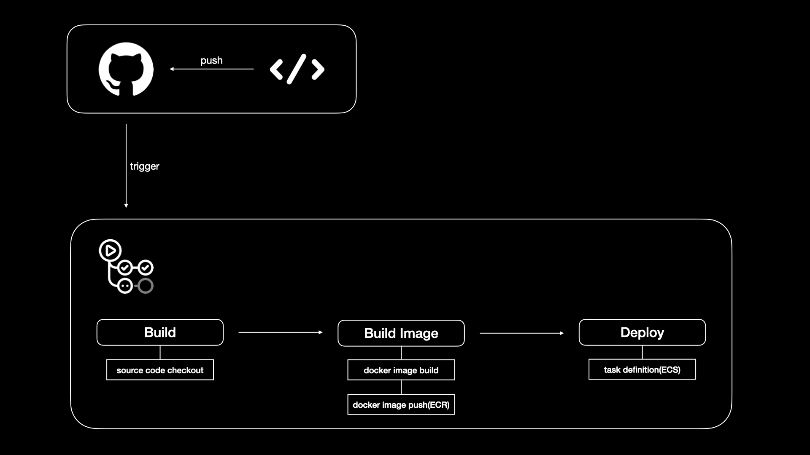

# #{PROJECT_NAME} [](https://www.python.org/downloads/) [](https://www.python.org/downloads/) [](https://www.python.org/downloads/)  

## Root Directory Structure
```
├── .github              # github action directory
├── .idea                # pycharm config directory
├── backend              # django project root directory
└── nginx                # nginx root directory
```


## Backend Directory Structure
```
└── backend
    ├── api              # django api directory
    ├── app              # django app directory
    ├── config           # django config directory
    └── templates        # django template directory
```


## Package
- [requirements.txt](./backend/requirements.txt)


## Set AWS Profile
AWS Secret Manager Role을 가진 IAM Profile 등록  
mkdir ~/.aws  
vi ~/.aws/config
```
[profile #{PROJECT_NAME}]
aws_access_key_id=**
aws_secret_access_key=**
region = ap-northeast-2
```


## Set Environments
- 파이참 사용 시 (`terminal`, `django console`, `python console` 모두 환경변수 등록 됨)
  ```
  # __PROJECT_ROOT__
  cp .idea/workspace.temp.xml .idea/workspace.xml
  ```
- 그 외 IDE
  ```
  AWS_DEFAULT_PROFILE=#{PROJECT_NAME}
  DJANGO_SETTINGS_MODULE=config.settings.local
  ```


## Install Virtual Environment & Dependency
```
# __PROJECT_ROOT__/backend
python -m venv .venv
source .venv/bin/activate
pip install -r requirements.txt
python manage.py githooks
```


## Commit Convention
```
========== 🟠 Run Commit 🟠 ==========
1) 🤖 Chore    : (기타 수정)     
2) 📚 Docs     : (문서 관련)     
3) ✨ Feat     : (기능 추가)     
4) 🐛 Fix      : (버그 수정)    
5) ⚡  Perf     : (성능 개선)     
6) 🔨 Refactor : (리팩토링)     
7) 🚨 Test     : (테스트) 
Select Commit Type: 
Input Commit Message:
```


## Run Server
```
python manage.py runserver 0:8000
```


## API Document
- http://api.localhost:8000/swagger/


# CICD Pipeline

